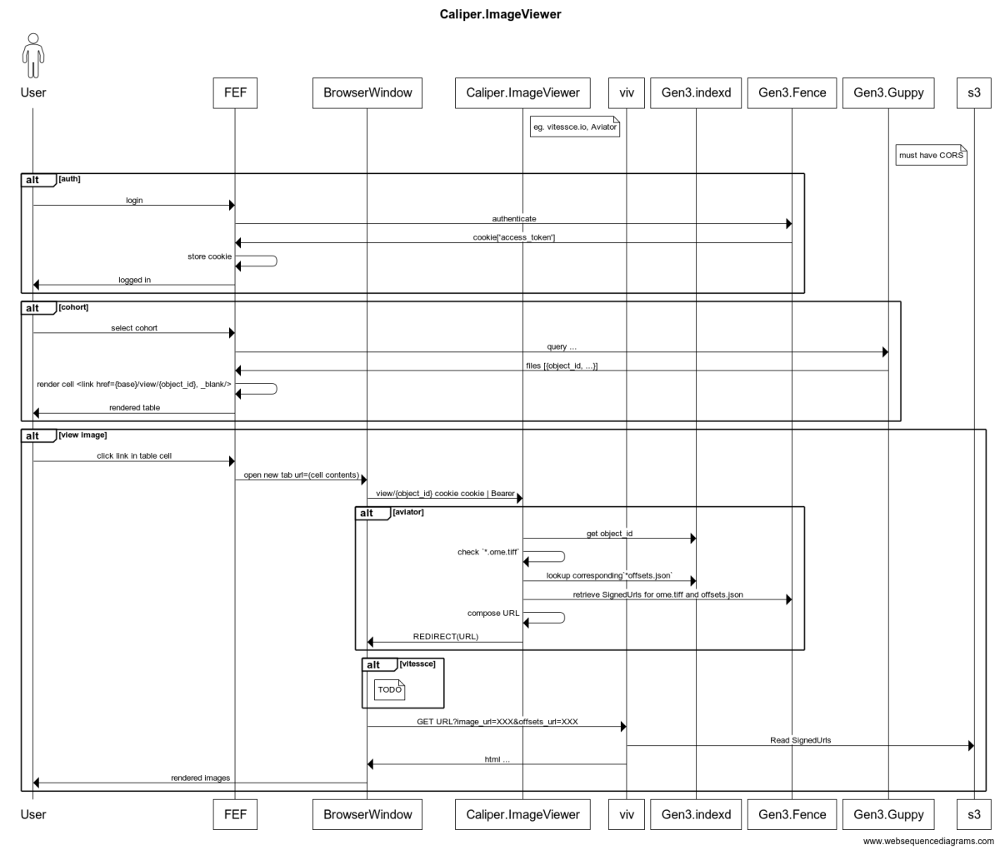

# Caliper Image Viewer

A FastAPI microservice for rendering a redirect URL which in turn contains a signed url for a given file.


## Project Description

This project provides an API for viewing images. It includes endpoints for health checks, retrieving signed urls for file objects, and accessing OpenAPI documentation.

## Installation

1. Clone the repository:
    ```sh
    git clone https://github.com/aced/image_viewer.git
    cd image_viewer
    ```

2. Create a virtual environment and activate it:
    ```sh
    python -m venv venv
    source venv/bin/activate  # On Windows use `venv\Scripts\activate`
    ```

3. Install the dependencies:
    ```sh
    pip install -r requirements.txt
   # or
    pip install .
    ```

## Usage

1. Run the FastAPI application:
    ```sh
    # by default, the application will render URLs for AVIVATOR
    # to overwrite this, set the environment variable BASE_URL
    # the URL will be BASE_URL{signed_url(object_id)}
    uvicorn image_viewer.app:app --reload
    ```

2. Access the API documentation:
    - OpenAPI: [http://127.0.0.1:8000/openapi.json](http://127.0.0.1:8000/openapi.json)
    - Swagger UI: [http://127.0.0.1:8000/docs](http://127.0.0.1:8000/docs)

## Endpoints

- `GET /_health`: Health check endpoint.
- `GET /view/{object_id}`: Redirects to the URL of the object.
- `GET /openapi.json`: OpenAPI documentation.
- `GET /docs`: Swagger UI.

## Running Tests

To run the tests, use the following command:
```sh
pytest
```

## Architecture Overview of `image_viewer.app`

The `image_viewer.app` is a FastAPI-based microservice designed to provide an API for viewing images. Below is an overview of its architecture:

### Components

1. **FastAPI Application**:
   - The core of the application, handling HTTP requests and routing.

2. **Configuration**:
   - Uses `pydantic`'s `BaseSettings` to manage configuration, loading config variables from a `.env` file or environment variables. 

3. **Endpoints**:
   - **Health Check**: `GET /_health` - Returns a status indicating the server is running.
   - **View Object**: `GET /view/{object_id}` - Redirects to a signed URL for the object.

4. **Utilities**:
   - **Object Signer**: A utility function `get_signed_url` to generate signed URLs for objects.

5. **Environment Variables**:
   - Managed through a `.env` file, or BASE_URL environmental variable, allowing dynamic configuration of the base URL for redirects.

### Dependencies

See [Slack Discussion](https://ohsucomputationalbio.slack.com/archives/C07GW6G69QE/p1725982750730089?thread_ts=1725923251.830729&cid=C07GW6G69QE)

* https://avivator.gehlenborglab.org
* https://vitessce.io/


Both of these:

* Render `tiff` files in the browser
* Are single-page apps that require signed URLs to access the data. The signed URLs are generated by Gen3.Fence
* The Caliper Image Viewer formats the URL and delivers the redirect response to FEF.


### Key Files

- **`app.py`**: Main application file containing the FastAPI app and endpoint definitions.
- **`.env`**: Environment configuration file.
- **`object_signer.py`**: Contains the `get_signed_url` function.
- **`tests/`**: Directory containing unit tests for the application.

### User Flow
- The caller can send a GET request to the /view/{object_id} endpoint to retrieve a signed URL for the specified object.
- The application will generate a signed URL for the object and return a 307 redirect to the signed URL.
  - Currently, the signed URL is generated by appending the object_id to the BASE_URL.  This is sufficient for the AVIVATOR use case.
  - For the VITESSE use case, the signed URL is included in a more complex "View config" object that is provided in the command line. See #1
- The caller MUST provide an authorization token either in the Authorization header (as a Bearer token) or as a cookie (access_token).
- The caller MUST handle the redirect to the signed URL to view the object. 307 status code is returned with the Location header containing the signed URL.


 

### Overview Diagram




### Future Work

- **Support for Multiple Object Types**: Currently, the application only supports tiff objects. Future work could include support viewers for additional object types [csv,json, files] .  
